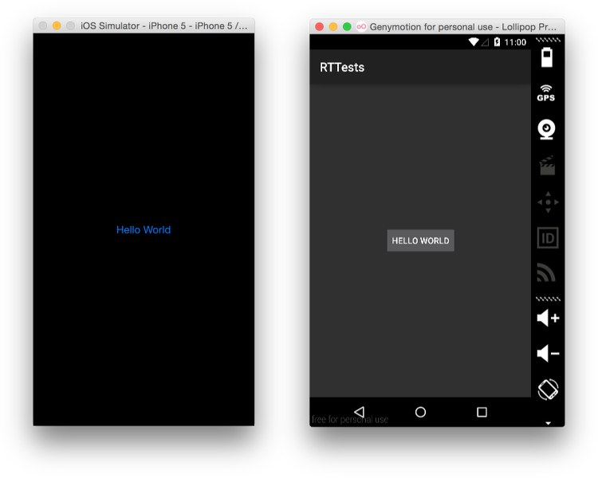

# Hello World

Our initial goal is to open a window and show the typical “Hello World” message.

The simplest one is the following:

```js
// Resources/app.js

import React from 'react';
import { render } from 'react-titanium';

import 'react-titanium/lib/built-ins/window';
import 'react-titanium/lib/built-ins/label';

const component = render(
  <window>
    <button>Hello World</button>
  </window>
);

component.getPublicInstance().open();
```

Run it on iOS with:

    titanium build --platform ios --tall

And on Android with:

    titanium build --platform android

And you should get something along the lines of this screenshot:



## Next steps

If you to better understand what happened, head to the [explanation](Explanation.md).

If you want to see how it compares to other frameworks, there’s a [comparison page](Comparison.md).
